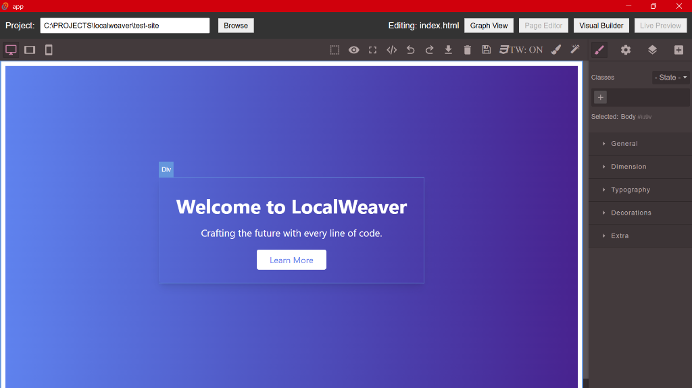
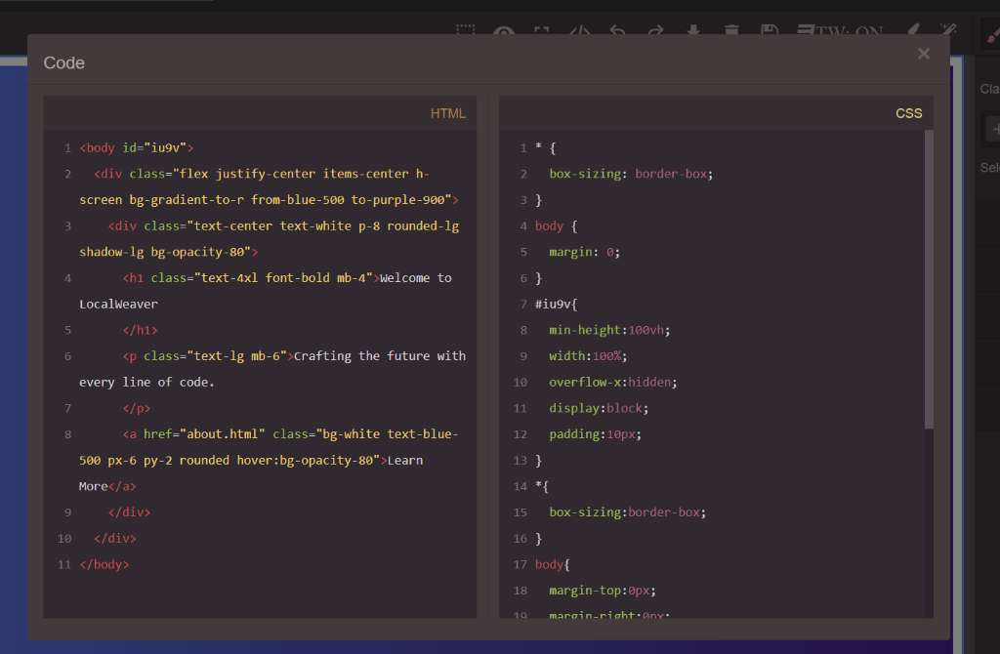
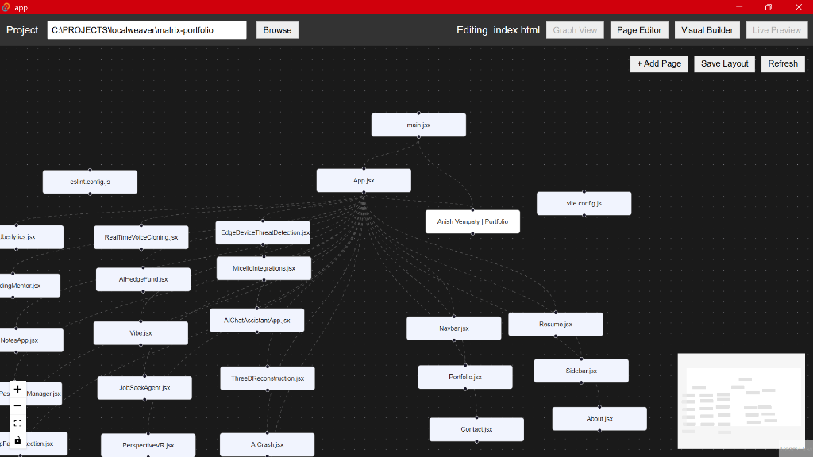
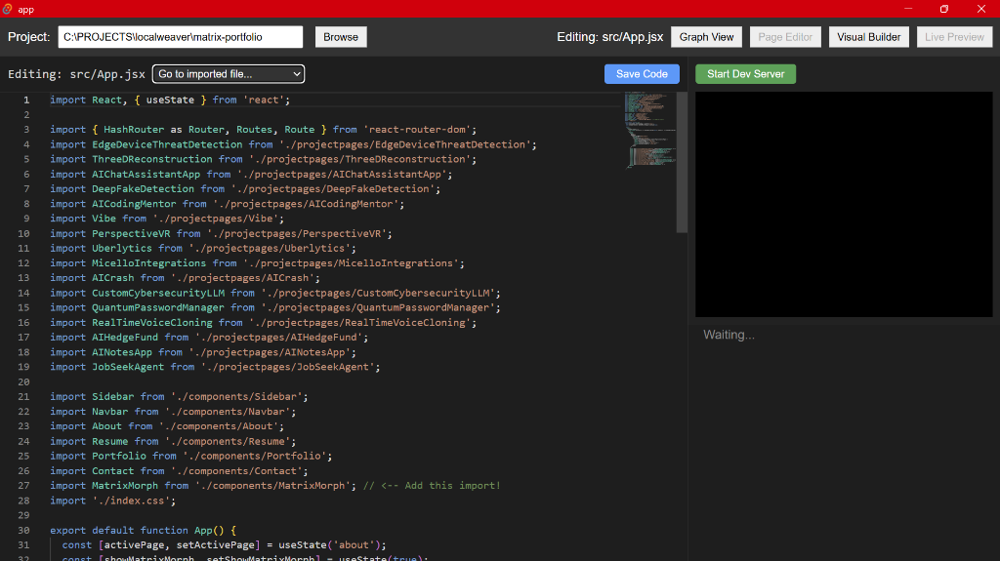
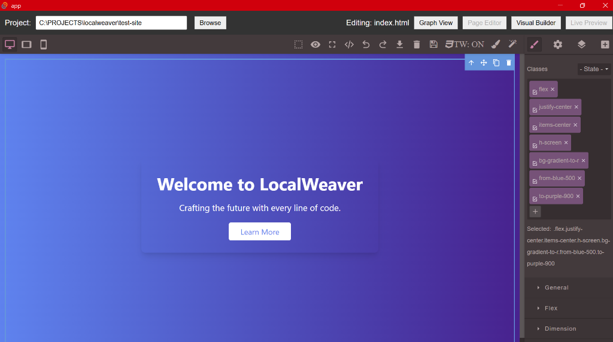

# LocalWeaver

LocalWeaver is a powerful desktop environment for web development that combines a visual node-based sitemap, a drag-and-drop HTML builder, and a robust code editor for React/Vue projects. It runs entirely locally, bridging the gap between visual design and your file system.

## Features

- **Visual Sitemap**: View your project structure as a graph. For HTML projects, it visualizes links. For React/Vue projects, it visualizes component dependencies.
- **Visual Builder (HTML)**: GrapesJS-powered editor with Drag-and-Drop, Tailwind CSS integration, and AI generation.
- **Code Editor (React/Vue)**: Full-featured Monaco editor with syntax highlighting for generic web development.
- **Local AI**: Built-in integration with `llama.cpp` for generating code and content offline.
- **File System Sync**: Changes in the editor are saved directly to your local files.

## Prerequisites

1. **Rust**: Required for the Tauri backend.
2. **Node.js**: Required for the frontend.
3. **llama-server**: Required for AI features.

## Installation & Setup

1. **Install Dependencies**:
   ```bash
   cd app
   npm install
   ```

2. **Start the AI Server** (Optional, for AI features):
   Download a GGUF model (e.g., Qwen2.5-Coder) and run:
   ```bash
   # In the project root or where you keep the server
   ./llama-server -m your-model.gguf --port 8081 -c 2048
   ```

3. **Run the App**:
   ```bash
   cd app
   npm run tauri dev
   ```

## Usage Guide

### 1. HTML Projects (Visual Builder)
When you open an `index.html` or any HTML file, LocalWeaver launches the **Visual Page Editor**.

*   **Drag & Drop**: Drag blocks (Text, Image, Cards, etc.) from the sidebar onto the canvas.
    *   **Double Click**: You can also **double-click** any block in the sidebar to instantly append it to the bottom of the page.
*   **Tailwind CSS**:
    *   **Toggle**: Use the `TW: ON/OFF` button in the toolbar to enable/disable Tailwind CSS support.
    *   **Visual Palette**: Click the Paint Brush icon to open the Tailwind Palette. Here you can visually apply:
        *   **Colors & Gradients**: Solid colors or custom gradients (Direction, From, To).
        *   **Typography**: Size, Weight, Alignment.
        *   **Layout**: Padding, Margin, Flexbox alignments, and "Fit to Page" helpers (e.g., `h-screen`).
        *   **Effects**: Borders, Radius, Shadows, Opacity.
*   **AI Generation**: Click the Magic Wand icon.
    *   Select an element to modify it, or select nothing to append to the body.
    *   *Tip*: To **replace** an element entirely, use keywords like "replace", "change", or "update" in your prompt. Otherwise, the AI will append the new content.

### 2. React / Vue Projects (Code Editor)
When you open a `.jsx`, `.tsx`, or `.vue` file, LocalWeaver switches to **Code Mode**.

*   **Graph View**: Visualizes your component import tree. You can see how `App.jsx` imports `Navbar.jsx`, etc.
*   **Code Editor**: Edit your code with syntax highlighting using the integrated Monaco editor.
*   **Important**: The **Drag-and-Drop Visual Builder DOES NOT work for React/Vue files**. You must use the Code Editor.
*   **AI Assistance**: You can still use the AI to generate code snippets, which you can paste into the editor.

### 3. Previewing Your App
*   **Start Dev Server**: Click this button (visible in React/Vue mode) to run your project's local dev server (e.g., `npm run dev`). 
    *   A terminal panel will appear showing the build output.
    *   A small live view will render the running app.
*   **Live Preview**: Click the "Live Preview" button in the top bar to open your running application in a separate method (e.g., full browser) for full-fidelity testing.

## Gallery

|                Visual Builder                |             Code Editor              |
| :------------------------------------------: | :----------------------------------: |
|  |  |

|              Graph View              |               React Editor               |
| :----------------------------------: | :--------------------------------------: |
|  |  |

|            Tailwind Palette             |
| :-------------------------------------: |
|  |
